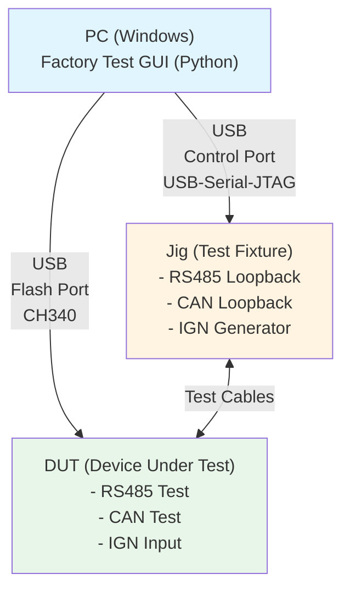
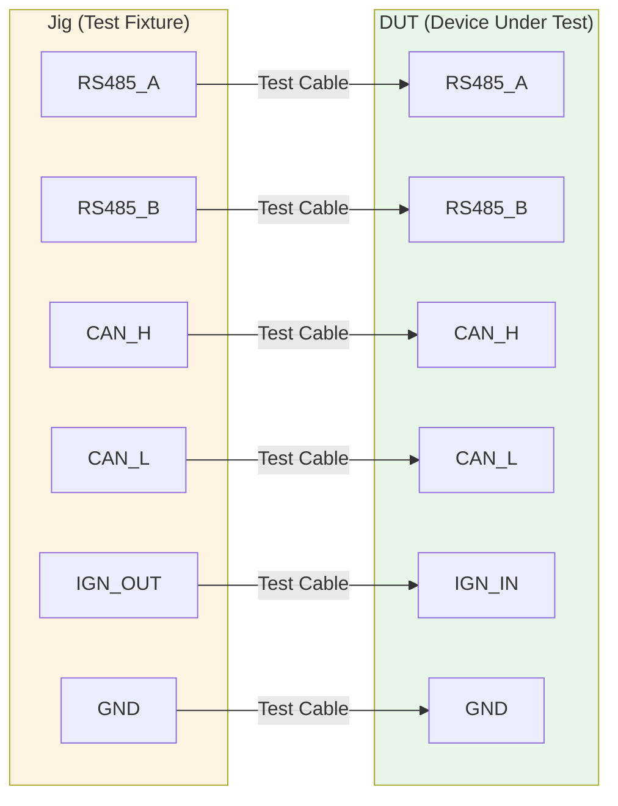
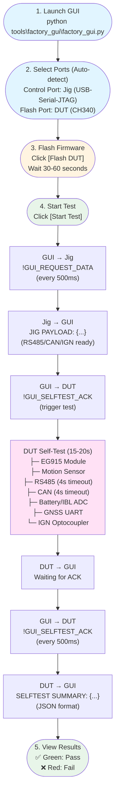

## System Overview



**Components:**
- **PC**: Runs test GUI software
- **Jig (Test Fixture)**: Provides RS485/CAN loopback and IGN signal
- **DUT (Device Under Test)**: PE board to be tested
- **Test Cables**: RS485, CAN, IGN connection cables

---

## Hardware Setup

### 1. Connect Test Cables (Jig ↔ DUT)



### 2. Connect USB Cables (PC ↔ Jig/DUT)

| Device | USB Type | Port Identification | Purpose |
|--------|----------|---------------------|---------|
| **Jig** | USB-Serial-JTAG | "USB Serial" / "JTAG" | Control Port (Jig Control) |
| **DUT** | CH340 | "CH340" / "CH343" / "CH9102" | Flash Port (Flashing/Testing) |

### 3. Power Check

- ✅ Jig powered normally (LED indicator)
- ✅ DUT powered normally
- ✅ All cables securely connected

---

## Software Setup

### Install Python Dependencies (First time only)

```bash
pip install PySide6 pyserial esptool
```

Detailed installation guide: [GUI_SETUP.md](tools/factory_gui/GUI_SETUP.md)

### Build Firmware (Only when code updates)

```bash
cd pe_board
idf.py build
```

---

## Test Procedure

### Test Flow Diagram



---

## Serial Command Protocol

### GUI → Jig (Control Port)

```
Command: !GUI_REQUEST_DATA
Purpose: Request Jig to send test ready status
Frequency: Every 500ms (20s timeout)
Response: JIG PAYLOAD: {"rs485_loopback": true, "can_loopback": true, ...}
```

### GUI → DUT (Flash Port)

```
Command: !GUI_SELFTEST_ACK
Purpose: ① Start DUT self-test  ② Trigger result output
Frequency: Every 500ms (20s timeout)
Response: SELFTEST SUMMARY: {"eg915_ok": true, "motion": {...}, ...}
```

---

## Test Items

| Item | Test Content | Pass Criteria | Timeout |
|------|--------------|---------------|---------|
| **EG915** | AT command comm., IMEI, ICCID | AT response OK | 2s |
| **Motion** | Magnetometer reading | mag > 0.1 | 1s |
| **RS485** | Loopback test (send 8 bytes) | Receive 8 bytes match | 4s |
| **CAN** | Loopback test (send 8 bytes) | Receive 8 bytes match | 4s |
| **Battery** | Battery voltage ADC | 0.441V ~ 0.539V | 1s |
| **IBL** | IO2 voltage ADC | > 0 mV | 1s |
| **GNSS** | UART data reception | > 0 bytes | 800ms |
| **IGN** | Optocoupler level change | HIGH→LOW→HIGH | 1s |

**Total Test Time**: 15-25 seconds

---

## Troubleshooting

### ❌ Port Not Detected

**Symptom**: No serial ports in dropdown menu

**Solution**:
1. Check USB cable connection
2. Click "Refresh Ports" button
3. Verify COM port in Device Manager
4. Install CH340 driver

---

### ❌ Flash Failed

**Symptom**: "Flash failed" error

**Solution**:
1. Confirm DUT is powered on
2. Replace USB cable (not charge-only cable)
3. Select correct Flash Port
4. Hold BOOT button and reconnect

---

### ❌ RS485/CAN Test Failed

**Symptom**: RS485 or CAN shows FAIL

**Solution**:
1. **If 4-second timeout**: 
   - Check cable connections between Jig and DUT
   - Confirm GND is connected
   - Test if Jig is working properly

2. **If hardware damaged**:
   - DUT will still complete test after 4 seconds
   - Result shows FAIL but doesn't affect other tests
   - Other test items execute normally

---

### ❌ Test Timeout

**Symptom**: "Timeout waiting for test results"

**Solution**:
1. Confirm all test cables connected (RS485/CAN/IGN)
2. Confirm Jig is powered and running
3. Re-flash DUT firmware
4. Restart GUI and retry test

---