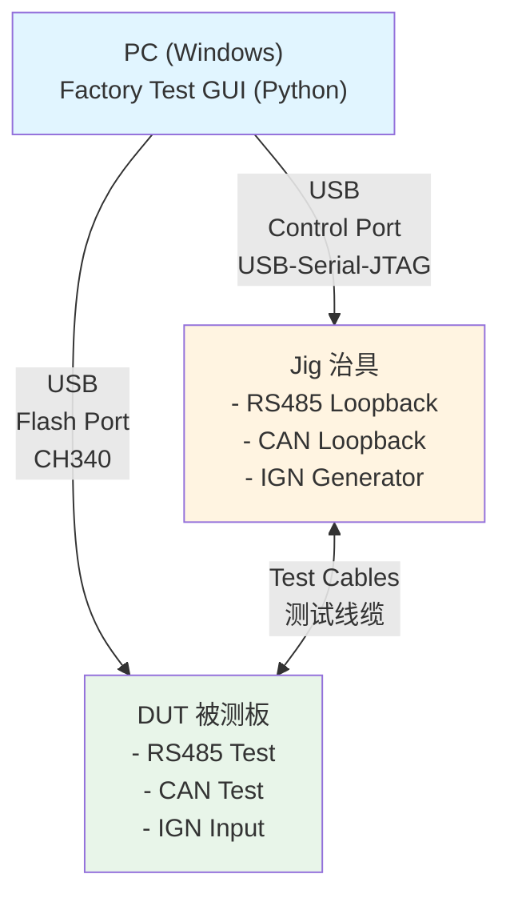
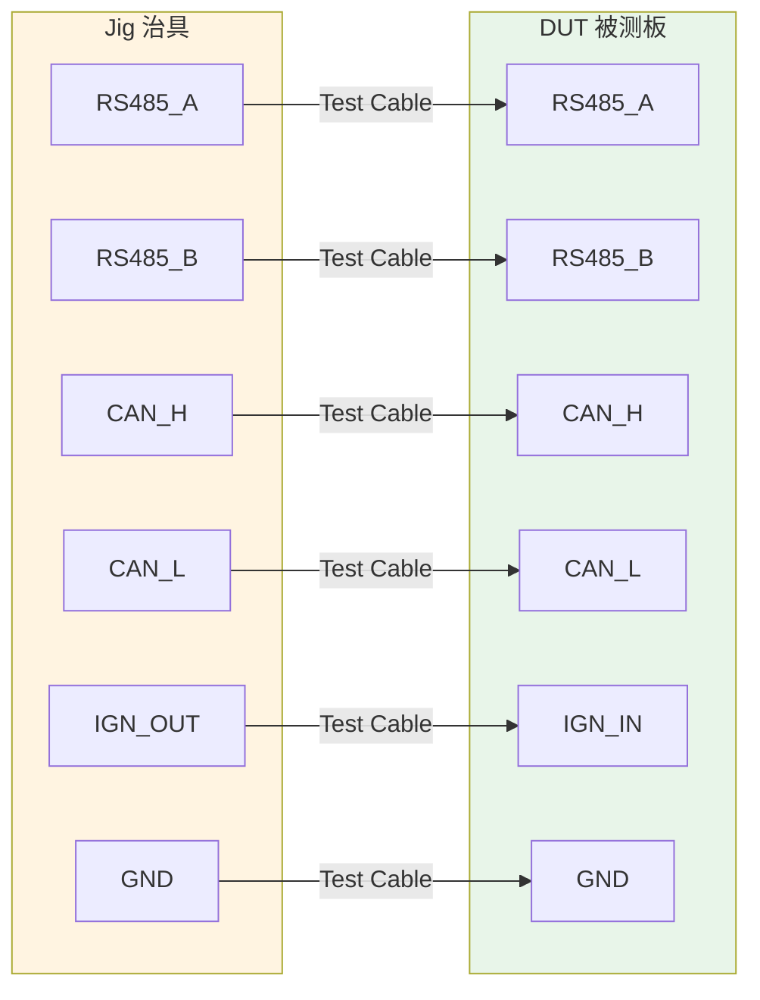
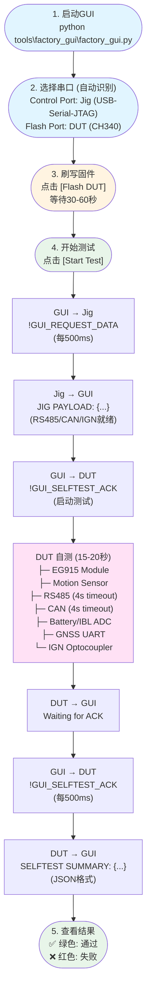

# PE Board Factory Test SOP

**简明操作手册 | Quick Start Guide**

---

## 系统架构 | System Overview



**组件说明:**
- **PC**: 运行测试GUI软件
- **Jig (治具)**: 提供RS485/CAN回环和IGN信号
- **DUT (被测设备)**: 待测试的PE板
- **Test Cables**: RS485、CAN、IGN测试连接线

---

## 硬件连接 | Hardware Setup

### 1. 连接测试线缆 (Jig ↔ DUT)



### 2. 连接USB线缆 (PC ↔ Jig/DUT)

| 设备 | USB类型 | 端口识别 | 用途 |
|------|---------|----------|------|
| **Jig** | USB-Serial-JTAG | "USB Serial" / "JTAG" | Control Port (治具控制) |
| **DUT** | CH340 | "CH340" / "CH343" / "CH9102" | Flash Port (刷机/测试) |

### 3. 上电检查

- ✅ Jig供电正常（LED指示）
- ✅ DUT供电正常
- ✅ 所有线缆连接牢固

---

## 软件准备 | Software Setup

### 安装Python依赖 (仅首次)

```bash
pip install PySide6 pyserial esptool
```

详细安装指南: [GUI_SETUP.md](tools/factory_gui/GUI_SETUP.md)

### 编译固件 (仅代码更新时)

```bash
cd pe_board
idf.py build
```

---

## 测试流程 | Test Procedure

### 测试流程图



---

## 串口命令协议 | Serial Commands

### GUI → Jig (Control Port)

```
命令: !GUI_REQUEST_DATA
用途: 请求治具发送测试准备状态
频率: 每500ms (超时20s)
响应: JIG PAYLOAD: {"rs485_loopback": true, "can_loopback": true, ...}
```

### GUI → DUT (Flash Port)

```
命令: !GUI_SELFTEST_ACK
用途: ① 启动DUT自测  ② 触发结果输出
频率: 每500ms (超时20s)
响应: SELFTEST SUMMARY: {"eg915_ok": true, "motion": {...}, ...}
```

---

## 测试项目 | Test Items

| 项目 | 测试内容 | 通过标准 | 超时 |
|------|----------|----------|------|
| **EG915** | AT命令通信、IMEI、ICCID | AT响应OK | 2s |
| **Motion** | 磁力计读数 | mag > 0.1 | 1s |
| **RS485** | 回环测试 (发送8字节) | 接收8字节匹配 | 4s |
| **CAN** | 回环测试 (发送8字节) | 接收8字节匹配 | 4s |
| **Battery** | 电池电压ADC | 0.441V ~ 0.539V | 1s |
| **IBL** | IO2电压ADC | > 0 mV | 1s |
| **GNSS** | UART数据接收 | > 0 bytes | 800ms |
| **IGN** | 光耦电平变化 | HIGH→LOW→HIGH | 1s |

**总测试时间**: 15-25秒

---

## 常见问题 | Troubleshooting

### ❌ 端口未检测到

**现象**: 下拉菜单中没有串口

**解决**:
1. 检查USB线缆连接
2. 点击"Refresh Ports"按钮
3. 确认设备管理器中有COM口
4. 安装CH340驱动程序

---

### ❌ 刷机失败

**现象**: "Flash failed" 错误

**解决**:
1. 确认DUT已上电
2. 更换USB数据线（非充电线）
3. 选择正确的Flash Port
4. 按住BOOT键后重新连接

---

### ❌ RS485/CAN测试失败

**现象**: RS485或CAN显示FAIL

**解决**:
1. **如果4秒超时**: 
   - 检查Jig和DUT之间的线缆连接
   - 确认GND已连接
   - 测试Jig是否工作正常

2. **如果硬件损坏**:
   - DUT仍会在4秒后完成测试
   - 结果显示FAIL但不影响其他测试
   - 其他测试项正常执行

---

### ❌ 测试超时

**现象**: "Timeout waiting for test results"

**解决**:
1. 确认所有测试线缆已连接 (RS485/CAN/IGN)
2. 确认Jig已上电且运行正常
3. 重新刷写DUT固件
4. 重启GUI重新测试

---

## 维护检查 | Maintenance

### 每日检查
- [ ] Jig电源指示灯亮起
- [ ] USB线缆完好无损
- [ ] 测试线缆连接正常
- [ ] GUI能正常识别端口

### 每周检查
- [ ] 用已知良品板验证治具功能
- [ ] 清洁测试治具触点
- [ ] 备份测试记录

---

## 截图示例 | Screenshots

*（请在此处添加操作截图）*

### 1. GUI主界面
*[添加GUI启动后的主界面截图]*

### 2. 端口选择
*[添加Control Port和Flash Port自动选择的截图]*

### 3. 刷机进度
*[添加Flash DUT进度条截图]*

### 4. 测试进行中
*[添加Start Test后的进度显示截图]*

### 5. 测试结果 - 通过
*[添加所有测试项PASS的截图]*

### 6. 测试结果 - 失败
*[添加某些测试项FAIL的截图]*

---

## 文档版本 | Revision

| 版本 | 日期 | 修改内容 |
|------|------|----------|
| 2.0 | 2025-11-21 | 简化版SOP，聚焦关键步骤 |
| 1.0 | 2025-11-21 | 初始版本 |

---

**技术支持**: 参考 [README.md](README.md) 和 [GUI_SETUP.md](tools/factory_gui/GUI_SETUP.md)
